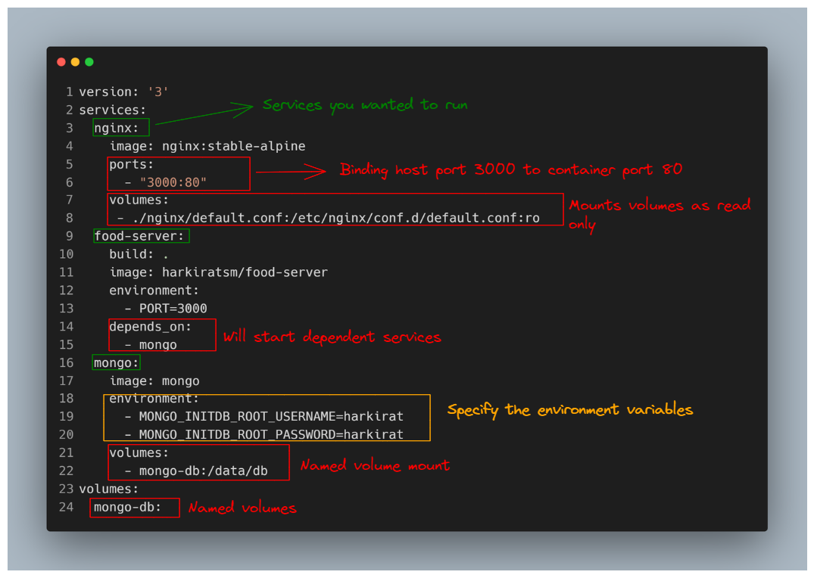

## Table of Contents
- [Dockerfile & Docker Compose](#docs)
- [Docker Compose explained](#exp)
- [Running in Production](#prod)

<a id="docs"></a>

### Dockerfile & Docker Compose

The ```Dockerfile``` is essentially the build instructions to build the image. 

Docker Compose is a tool that helps us overcome this problem and easily handle multiple containers at once.

For more details head over to official documentation
- [Dockerfile](https://docs.docker.com/get-started/02_our_app/)
- [Docker-Compose](https://docs.docker.com/compose/)
& also can checkout my blog [here](https://community.ops.io/harkiratsm/docker-simplified-4bce)

<a id="exp"></a>

#### Docker Compose Explained




<a id="prod"></a>

### Running your server in Production 

1) For running your app in ```prod``` you can use AWS , GCP , AZURE. For this I used ```DigitalOcean``` but you choose anyone of these CSP's.

2) Next step is to create a new project.


Head over to create a new Droplet for your project.


Choose your options ,for this I used following settings 
- Ubuntu (20.04 LTS x64)
- Basic
- CPU options 
    - Premium Intel with NVMe SSD ($6/month)
- Choose the nearest datacenter


Select your project and you are all done , hit the ```CREATE``` 

It would take some time to spin the droplet.

3) Open your CMD prompt & type 
```bash
ssh root@<ip_address>
```
Note : This is ip address of your droplet.

4) Install ```docker``` and ```docker compose``` on your Droplet 
```bash

curl -fsSL https://get.docker.com -o get-docker.sh
sh get-docker.sh

```

```bash
sudo apt-get install docker-compose-plugin
```

5) Clone your project from ```github```

```bash
git clone <repo_url>
```
& run

```bash
make docker-compose_prod
```

You are all done ✔️!!
Note : Make sure never do build in ```prod``` as it may take more resource utilization & make sure to delete the droplet when you done. 

